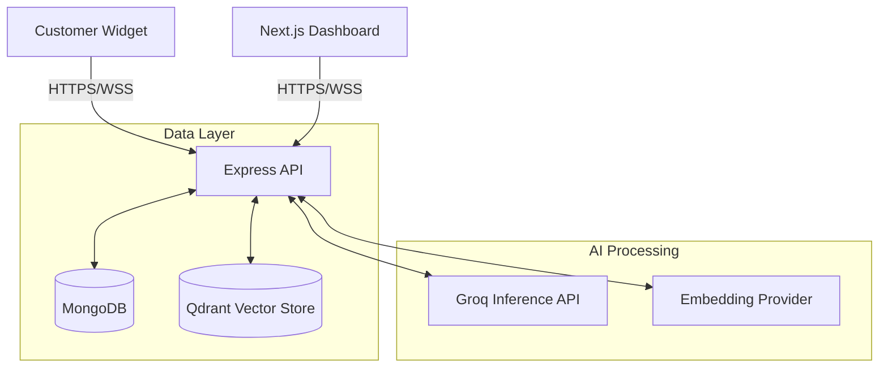

# Magnetic AI Support Platform

Magnetic AI is a multi-tenant customer support platform that integrates Retrieval-Augmented Generation (RAG) to automate responses using tenant-specific knowledge bases. When automated resolution is not possible, the platform facilitates handoff to human agents via real-time WebSocket connections.

## Architecture

The system is designed with separate frontend and backend components, maintaining isolated data boundaries per tenant.



### Components
- **Frontend (Dashboard)**: Next.js 14 App Router, TypeScript, Tailwind CSS, React Hook Form, Recharts.
- **Backend (API)**: Node.js, Express, Socket.io, TypeScript.
- **Database**: MongoDB Atlas for relational and application data. Qdrant for vector embeddings and similarity search.
- **LLM/Embeddings**: Groq (Llama-3.3-70b) for text generation. Compatible with OpenAI, HuggingFace, Cohere, or Ollama for embeddings.

## Repository Structure

```
.
├── backend/                  # Express REST API and WebSocket services
│   ├── src/controllers/      # Route controllers
│   ├── src/services/         # RAG and business logic
│   ├── src/models/           # Mongoose database schemas
│   └── src/socket/           # WebSocket event handlers
├── frontend/                 # Next.js Dashboard application
│   ├── app/                  # Route definitions
│   └── components/           # React UI components
├── docker-compose.yml        # Local infrastructure definitions
└── package.json              # Monorepo configuration
```

## Local Development

### Prerequisites
- Node.js (v18+)
- Docker and Docker Compose
- Groq API Key
- Supported Embedding Provider API Key (OpenAI, HuggingFace, etc.)

### Setup Instructions

1. **Install dependencies**
   The project uses npm workspaces to manage dependencies across the monorepo.
   ```bash
   npm install
   ```

2. **Configure environment variables**
   ```bash
   cp .env.example backend/.env
   cp .env.example frontend/.env.local
   ```
   Edit the `.env` files with your specific API keys and credentials.

3. **Start local infrastructure**
   This will start MongoDB and Qdrant containers.
   ```bash
   docker compose up -d
   ```

4. **Seed the database**
   Creates default tenant and administrator accounts.
   ```bash
   npm run seed
   ```
   *Test account credentials: `admin@demo.com` / `Demo@1234`*

5. **Start development servers**
   Runs both frontend and backend concurrently.
   ```bash
   npm run dev
   ```

## Integration

### Widget Embed
To embed the support widget on a client site, include the provided script tag. Tenant context is managed via the `data-tenant-id` attribute.

```html
<script src="https://api.yourdomain.com/widget.js" data-tenant-id="<TENANT_ID>"></script>
```

## API Documentation

All administrative endpoints require Bearer token authentication. Tenant context is extracted from the JWT payload.

| Resource | Endpoints |
| --- | --- |
| **Auth** | `POST /api/auth/register`, `POST /api/auth/login`, `GET /api/auth/me` |
| **Knowledge Base** | `POST /api/kb/upload`, `GET /api/kb/documents` |
| **Chat** | `POST /api/chat/session`, `POST /api/chat/message` |
| **Tickets** | `GET /api/tickets`, `PUT /api/tickets/:id`, `POST /api/tickets/:id/escalate` |
| **Analytics** | `GET /api/analytics/overview`, `GET /api/analytics/charts` |
| **Widget Config** | `GET /api/widget/:tenantId/config` |

## Deployment

- **Frontend**: Deploy `frontend/` directory to Vercel or similar Next.js-compatible hosting. Set `NEXT_PUBLIC_API_URL` and `NEXT_PUBLIC_SOCKET_URL` in the environment configuration.
- **Backend**: Deploy `backend/` directory to a Node.js runtime environment (Railway, Render, AWS). Ensure `FRONTEND_URL` is set appropriately to satisfy CORS requirements.
- **Databases**: Use managed services such as MongoDB Atlas and Qdrant Cloud for production environments.

## License

MIT License. See `LICENSE` for more information.
