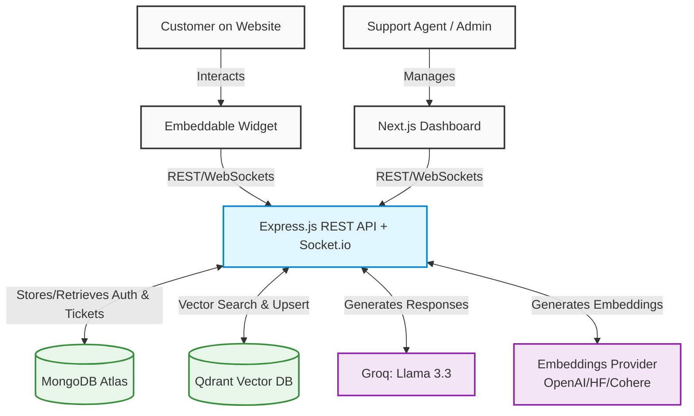

<div align="center">
  <br />
  <h1>🧲 Magnetic AI Support Platform</h1>
  <p>
    <strong>A production-oriented, multi-tenant customer support SaaS</strong>
  </p>
  <p>
    Tenant-isolated knowledge bases • RAG answers • Real-time human handoff • Embeddable widget
  </p>
  <br />
</div>

## 🌟 Overview

Magnetic AI is a robust, scalable Customer Support Platform that leverages Retrieval-Augmented Generation (RAG) to provide automated, highly accurate answers to customer queries based on tenant-specific knowledge bases. When the AI detects a complex issue, it seamlessly escalates the conversation to human agents through real-time socket connections. 

It acts as a complete Helpdesk SaaS solution, offering a fully-featured dashboard for support agents, real-time analytics, widget embed scripts for customers, and isolated data environments for different tenants.

---

## ✨ Key Features

- 🏢 **Multi-Tenancy:** Secure, tenant-isolated knowledge bases and configurations. One platform, multiple client companies.
- 🧠 **AI-Powered Resolution:** Uses state-of-the-art LLMs (Groq `llama-3.3-70b-versatile`) and Embeddings (OpenAI / Hugging Face / Cohere / Ollama) to answer customer queries accurately.
- 📚 **Dynamic Knowledge Base:** Upload PDFs and documents. The platform automatically chunks, embeds, and indexes them in a Vector Database (Qdrant).
- 🤝 **Real-Time Human Handoff:** Built-in escalation routing. When AI is uncertain, tickets are smoothly passed to live agents via Socket.io.
- 💬 **Embeddable Widget:** Easily embed the AI chatbot on any client website using a single `<script>` tag.
- 📊 **Analytics Dashboard:** Monitor unresolved tickets, AI deflection rates, escalation frequency, and system usage.
- 🔒 **Enterprise-Grade Security:** Role-Based Access Control, JWT-based authentication, bcrypt hashing, and rate limiting.

---

## 🏗️ Architecture Flow

The system employs a clear separation of concerns, ensuring high performance, scalability, and security across frontend, backend, and data stores.



---

## 🛠️ Tech Stack

### Frontend
- **Framework:** [Next.js 14](https://nextjs.org/) (App Router)
- **Language:** TypeScript
- **Styling:** Tailwind CSS, Radix UI (via shadcn/ui concepts)
- **State Management & Forms:** React Hook Form, Zod, React Hot Toast
- **Real-Time:** Socket.io-Client
- **Charts:** Recharts

### Backend
- **Runtime:** [Node.js 18+](https://nodejs.org/)
- **Framework:** Express.js, Socket.io
- **Language:** TypeScript
- **Database (Relational/Document):** MongoDB (Mongoose)
- **Database (Vector):** Qdrant
- **AI / LLM:** Groq SDK
- **Document Processing:** PDF-Parse, Mammoth
- **Security:** Helmet, CORS, Express Rate Limit, JWT

---

## 📁 Project Structure

```text
magnetic-ai/
├── backend/                  # Express.js REST API & WebSocket server
│   ├── src/
│   │   ├── controllers/      # Route handlers
│   │   ├── models/           # Mongoose schemas
│   │   ├── routes/           # API route definitions
│   │   ├── services/         # AI, RAG, and core business logic
│   │   ├── socket/           # WebSocket event handlers
│   │   └── server.ts         # Entry point
│   ├── tests/                # Unit and Integration tests
│   └── widget/               # Compiled widget assets for embedding
├── frontend/                 # Next.js Application
│   ├── app/                  # App Router pages and API routes
│   ├── components/           # Reusable React components (UI, Layouts)
│   ├── lib/                  # Utility functions and API clients
│   └── tailwind.config.ts    # Styling configuration
├── docker-compose.yml        # Local infrastructure (MongoDB, Qdrant)
└── package.json              # Monorepo workspace configuration
```

---

## 🚀 Getting Started

Follow these steps to set up the platform locally for development.

### Prerequisites
- **Node.js** v18 or newer
- **Docker** and **Docker Compose**
- **API Keys**:
  - [Groq API Key](https://console.groq.com) (Free)
  - Embedding Provider Key (e.g., HuggingFace, OpenAI, Cohere, or local Ollama instance)

### 1. Clone the repository
```bash
git clone https://github.com/your-username/magnetic-ai.git
cd magnetic-ai
```

### 2. Install Dependencies
This project uses npm workspaces to manage dependencies for both frontend and backend.
```bash
npm install
```

### 3. Environment Configuration
Copy the `.env.example` file to create your local `.env` files.
```bash
cp .env.example backend/.env
cp .env.example frontend/.env.local
```

**Key variables to set in `backend/.env`:**
- `GROQ_API_KEY`: Your Groq API key for LLM generation.
- `EMBEDDING_PROVIDER`: E.g., `huggingface`, `openai`. Set the respective API key below it.
- `JWT_SECRET` & `JWT_REFRESH_SECRET`: Secure random strings.

**Key variables to set in `frontend/.env.local`:**
- `NEXT_PUBLIC_API_URL=http://localhost:5000`
- `NEXT_PUBLIC_SOCKET_URL=http://localhost:5000`

### 4. Start Local Infrastructure
Spin up the local instances of MongoDB and Qdrant using Docker.
```bash
docker compose up -d
```

### 5. Seed Database
Seed the database with a default admin user and demo tenant.
```bash
npm run seed
```
*Default login:* `admin@demo.com` / `Demo@1234`

### 6. Run Development Servers
Start both the frontend Next.js app and the backend Express server concurrently.
```bash
npm run dev
```

- **Frontend Dashboard:** [http://localhost:3000](http://localhost:3000)
- **Backend API:** [http://localhost:5000](http://localhost:5000)

---

## 🧩 Embedding the Widget

To embed the AI support chat widget on any client website, simply add the following `<script>` tag just before the closing `</body>` tag.

```html
<script src="https://api.yourdomain.com/widget.js" data-tenant-id="YOUR_TENANT_ID"></script>
```
*(Replace `api.yourdomain.com` with your deployed backend URL, and `YOUR_TENANT_ID` with the Tenant ID found in the dashboard settings).*

---

## 📖 Core API Reference

| Domain | Endpoints | Description |
|---|---|---|
| **Authentication** | `POST /api/auth/register`, `login`, `refresh`, `GET /me` | Tenant and User authentication (JWT based). |
| **Knowledge Base** | `POST /api/kb/upload`, `GET /documents` | Upload PDFs/Docs, parse, and store embeddings in Qdrant. |
| **Chat Interaction**| `POST /api/chat/session`, `POST /api/chat/message` | Initialize widget sessions and handle RAG message flows. |
| **Tickets** | `GET /api/tickets`, `PUT /api/tickets/:id`, `POST /escalate` | Manage, update, and escalate human-handoff tickets. |
| **Analytics** | `GET /api/analytics/overview`, `/charts` | Retrieve deflection rates, active tickets, and historical charts. |
| **Widget Config** | `GET /api/widget/:tenantId/config` | Fetches custom branding (colors, logos, greetings) for the widget. |

*Note: All API requests (except public widget endpoints) require a Bearer token in the `Authorization` header. Tenant context is implicitly derived from the token.*

---

## ☁️ Deployment

### Frontend (Vercel)
Deploy the `frontend` folder directly to [Vercel](https://vercel.com).
- Framework Preset: Next.js
- Root Directory: `frontend`
- Environment Variables: `NEXT_PUBLIC_API_URL`, `NEXT_PUBLIC_SOCKET_URL`.

### Backend (Railway / Render / AWS)
Deploy the `backend` folder to a Node.js hosting provider like [Railway](https://railway.app).
- Set all environment variables defined in `.env.example`.
- Ensure `FRONTEND_URL` is set to your deployed Vercel domain to allow CORS.

### Databases
- **MongoDB**: Provision a cluster on [MongoDB Atlas](https://www.mongodb.com/cloud/atlas).
- **Qdrant**: Provision a free cluster on [Qdrant Cloud](https://cloud.qdrant.io/).

---

## 🤝 Contributing

1. Fork the repository
2. Create a new feature branch (`git checkout -b feature/amazing-feature`)
3. Commit your changes (`git commit -m 'feat: add amazing feature'`)
4. Push to the branch (`git push origin feature/amazing-feature`)
5. Open a Pull Request

## 📄 License

This project is licensed under the MIT License - see the [LICENSE](LICENSE) file for details.
