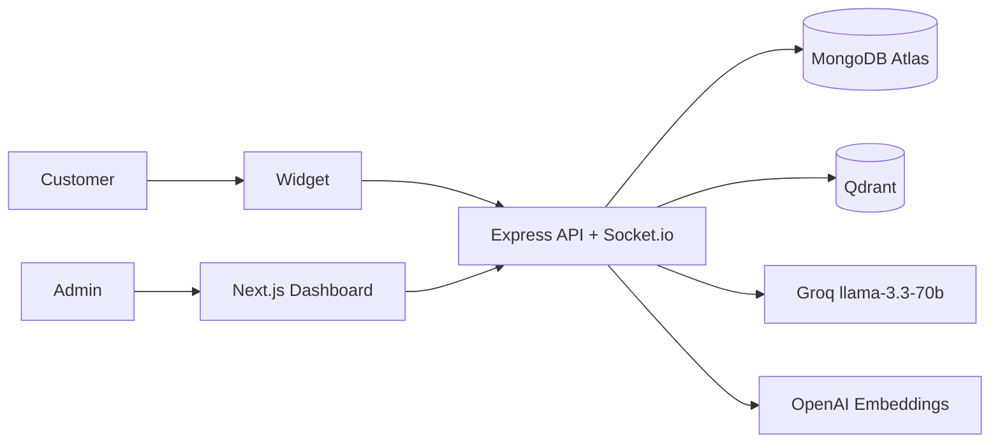

# Magnetic AI Support Platform

Production-oriented multi-tenant customer support SaaS with tenant-isolated knowledge bases, RAG answers, automatic escalations, tickets, analytics, realtime human handoff, and an embeddable widget.

## Architecture



| Layer | Technology |
|---|---|
| Frontend | Next.js 14, TypeScript, Tailwind, React Hook Form, Zod, Recharts |
| Backend | Node.js, Express, TypeScript, Socket.io |
| Data | MongoDB Atlas with Mongoose, Qdrant |
| AI | Groq `llama-3.3-70b-versatile`, OpenAI `text-embedding-3-small` |
| Security | JWT access/refresh tokens, bcrypt, Helmet, CORS, rate limiting |

## Local Setup

Prerequisites: Node.js 18+, Docker, MongoDB Atlas account, Groq API key, and OpenAI API key for embeddings.

```bash
git clone <repository-url>
cd ai-support-platform
npm install
cp .env.example backend/.env
cp .env.example frontend/.env.local
docker compose up -d
npm run seed
npm run dev
```

Demo login: `admin@demo.com` / `Demo@1234`

## Deployment

Deploy `frontend` to Vercel and set `NEXT_PUBLIC_API_URL` and `NEXT_PUBLIC_SOCKET_URL`. Deploy `backend` to Railway with the backend environment variables. Use MongoDB Atlas for MongoDB and a persistent Qdrant service. Set `FRONTEND_URL` to the Vercel origin.

## Widget

```html
<script src="https://api.yourdomain.com/widget.js" data-tenant-id="abc123"></script>
```

## API

| Area | Endpoints |
|---|---|
| Auth | `POST /api/auth/register`, `login`, `forgot-password`, `reset-password`, `refresh`; `GET /me` |
| Knowledge Base | `POST /api/kb/upload`, `reindex`; `GET /documents`, `/documents/:id`; `DELETE /documents/:id` |
| Config | `GET/PUT /api/config/bot`, `POST /api/config/test` |
| Chat | `POST /api/chat/session`, `/message`; `GET /history/:sessionId` |
| Tickets | `GET /api/tickets`, `/:id`, `/escalated`; `PUT /:id`; `POST /:id/escalate` |
| Conversations | `GET /api/conversations`, `/:id`; `DELETE /:id` |
| Analytics | `GET /api/analytics/overview`, `/charts`, `/kb`, `/escalations` |
| Widget | `GET /api/widget/:tenantId/config` |

Every authenticated database query is scoped by the tenant extracted from the JWT. Qdrant uses one collection per tenant, named `kb_{tenantId}`.
